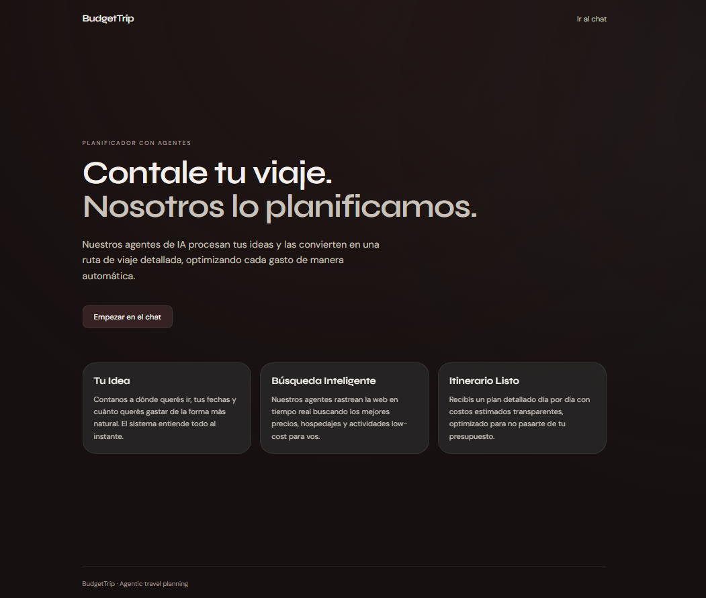
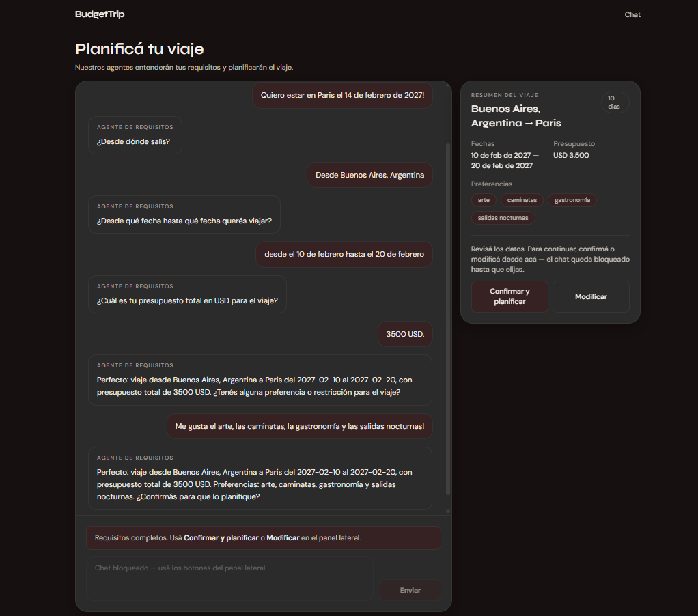
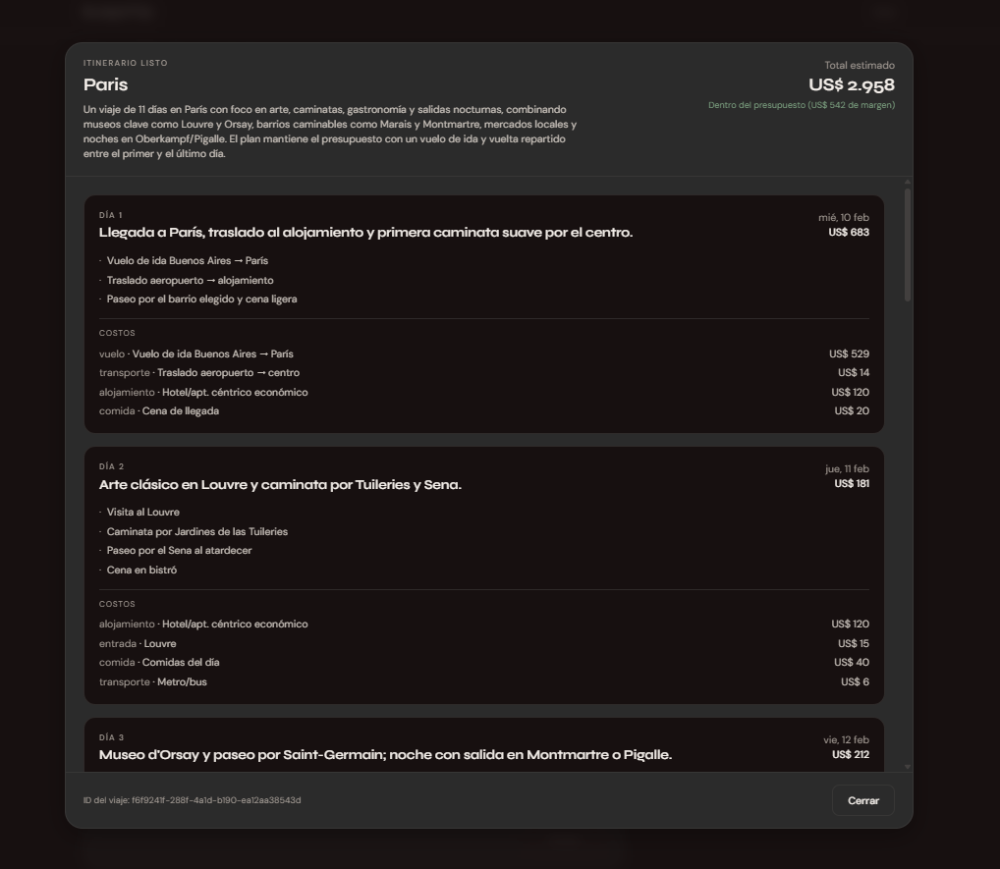

# BudgetTrip

A learning project built around the **OpenAI Agents SDK**. The main goal was to wire up agents, move pieces around, and see what comes back — not to ship a production app.

BudgetTrip is a budget-aware trip planner: a chat agent collects travel requirements, then a code-orchestrated pipeline plans web searches, runs them, and writes a day-by-day itinerary with deterministic budget checks.

## What I was exploring

- Defining agents with the OpenAI Agents SDK (requirements, planner, search, writer)
- Structured outputs with Pydantic (`RequirementsTurn` in `budgettrip/domain/entities.py` is the main example — `output_type` on the requirements agent plus rich `Field` descriptions)
- Tools (`calculate_budget_tool`) and orchestration by code instead of handoffs
- Clean Architecture layers: domain → application → infrastructure → API + a React frontend on top


## Where things live

`Agentss.txt` has the full file map for agent config, tools, ports, domain models, and tests. Quick pointers:


| Area                   | Path                                                     |
| ---------------------- | -------------------------------------------------------- |
| Agents                 | `budgettrip/infrastructure/agents_sdk/`                  |
| Instructions / prompts | `budgettrip/infrastructure/agents_sdk/instructions.py`   |
| Domain models          | `budgettrip/domain/entities.py`                          |
| Use case orchestration | `budgettrip/application/use_cases/plan_trip_use_case.py` |
| API                    | `budgettrip/interfaces/api/`                             |
| Frontend               | `budgettrip/frontend/`                                   |


More detailed setup and API docs are in `[budgettrip/README.md](budgettrip/README.md)`.

## Problems I hit (and how I fixed them)

While I was testing the requirements chat agent, a few things broke in practice:

1. **Preferences** — the agent marked `complete=true` without actually asking about preferences. I added `preferences_asked` and a 3-step flow (required fields → preferences → confirmation) in `entities.py` and `requirements_agent.py`.
2. **Dates** — users typed dates in mixed formats (`1/2/27`, `2027-02-8`, etc.) and the model didn't normalize them. I added parsing rules in `instructions.py` so output is always `YYYY-MM-DD`.
3. **State / loops** — re-parsing only the chat text made the agent forget fields already answered. I updated `requirements_agent.py` to take the previous `RequirementsTurn`, feed it into the prompt, and merge defensively when the LLM drops values.


## Quick start

**Backend** (from `budgettrip/`):

```bash
python -m venv .venv
.venv\Scripts\activate        # Windows
pip install -e ".[dev]"
cp .env.example .env            # add OPENAI_API_KEY, API_SECRET_KEY, etc.
pytest
uvicorn budgettrip.interfaces.api.main:app --reload
```

**Frontend** (from `budgettrip/frontend/`):

```bash
npm install
cp .env.example .env
npm run dev
```
## System Images

---

---



Open `http://localhost:5173` with the API running on `http://localhost:8000`.

## Stack

- Python 3.12+, FastAPI, OpenAI Agents SDK, Pydantic
- React + TypeScript + Vite + Tailwind (frontend)

